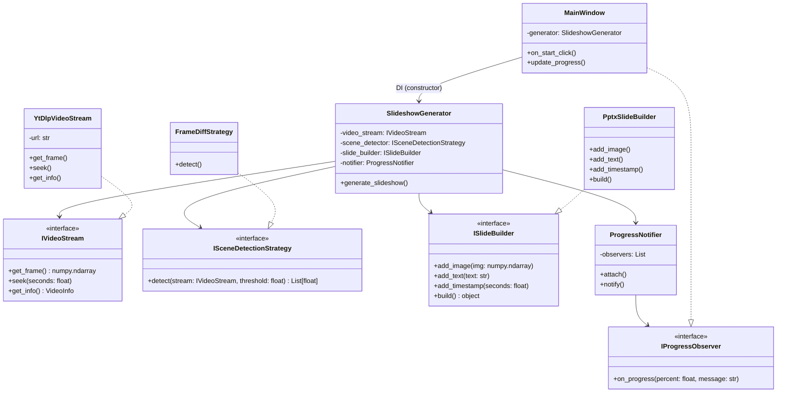

# YouTube Video → PPTX Slayt Dönüştürücü Proje Karar Raporu

## Proje Bilgileri

| Alan | Değer |
|---|---|
| Proje Adı | YouTube2Slides – İndirmeden, Sahne Tespiti ile Slayt Dönüştürücü |
| Son Güncelleme | 2026-05-08 |
| Hedef Platform | Windows |

---

# 1. Proje Hedefi ve Kapsamı

YouTube videosunu diske indirmeden, otomatik sahne geçişi tespiti yaparak PowerPoint (PPTX) slayt dosyasına dönüştüren, basit masaüstü GUI'li bir Python programı geliştirmek.

Kullanıcı tek veya birden fazla video URL'sini sırayla işleyebilir.

> Güncelleme: Video süresi sınırı 7 saat olarak belirlenmiştir.  
> Zaman planı: Raporun 10. maddesi (zaman planı) kullanıcı talebiyle kaldırılmıştır.

---

# 2. Gereksinim Kararları (Kullanıcı Cevapları)

Aşağıdaki kararlar, proje yöneticisinin sorduğu 11 soruya verilen yanıtlarla kesinleşmiştir.

> Güncelleme: Maddelerde yapılan değişiklikler italik ile gösterilmiştir.

| Soru No | Karar | Detay |
|---|---|---|
| 1 | Çıktı formatı | PPTX (PowerPoint) |
| 2 | Slayt üretme mantığı | Otomatik sahne geçişi tespiti (scene change detection) – her kare işlenir; önce basit eşitlik testi ile bir önceki kareyle aynı olan kareler atlanır |
| 3 | Max video süresi & uzun video stratejisi | 7 saat; her kare sırayla işlenir, ancak önceki kareyle aynı olan kareler detaylı analize girmez (bellek koruması için kareler işlendiği anda serbest bırakılır) |
| 4 | İndirmeden işlem | Video asla diske yazılmayacak, sadece RAM üzerinden akış (stream) ile işlenecek – fallback olarak geçici dosya kullanılabilir |
| 5 | Kullanıcı arayüzü | Basit masaüstü GUI (Tkinter) – işlem ayrı thread'te, queue ile progress güncelleme |
| 6 | Kalite & özelleştirme | Orijinal video çözünürlüğü; slayt görselleri max 1024px genişlik, JPEG %85 kalite ile sıkıştırılır; her slaytta zaman damgası + video başlığı; altyazılar bu sürümde dahil edilmeyecek, ancak yapı Open/Closed prensibine uygun hazırlanacak |
| 7 | YouTube erişim yöntemi | yt-dlp kütüphanesi; cookie desteği hayır; kullanım amacı kişisel – pipe üzerinden akış, sorun halinde geçici dosya fallback'i |
| 8 | Hata yönetimi & loglama | Tek URL için hata -> mesaj gösterilip çıkılır. Birden fazla URL için hatalı URL atlanır, diğerleri işlenir; sonunda özet hata mesajı gösterilir. Log dosyası tutulmaz |
| 9 | Toplu işlem | Evet, birden fazla URL sırayla işlenecek (paralel işlem yok) |
| 10 | Ek özellikler | Hiçbiri (sadece temel dönüşüm) – altyazı özelliği sonraki sürüm için ayrılmıştır |
| 11 | Zaman / Lisans / İşletim sistemi | Zaman planı rapordan kaldırılmıştır, üçüncü parti lisans sorunu yok, Windows |

---

# 3. Teknik Gereksinimler

| Parametre | Değer |
|---|---|
| Maksimum video uzunluğu | 7 saat |
| Uzun video işleme stratejisi | Tüm kareler sırayla okunur, her kare işlenmeden önce basit eşitlik testi (örneğin hash veya piksel farkı) ile bir önceki kareyle aynı olanlar atlanır; bellek sızıntısını önlemek için kareler işlendiği anda serbest bırakılır |
| Bellek sınırı | 2 GB'ı aşmamalı |
| İşletim sistemi | Windows 10/11 |
| Kullanıcı arayüzü | Tkinter, işlem ayrı thread'te çalışır, progress güncellemeleri queue.Queue ile ana thread'e iletilir |
| Hata mesajları (tek URL) | tkinter.messagebox.showerror ile göster, ardından sys.exit(1) |
| Hata yönetimi (çoklu URL) | Hatalı URL atlanır, sonraki URL işlenir; tüm işlem bitince özet pencere gösterilir |
| Loglama | Hayır |

---

# 4. Teknoloji Seçimleri (Kesin)

| Bileşen | Seçilen Kütüphane/Araç | Gerekçe |
|---|---|---|
| Video akışı alma | yt-dlp (pipe ile stdout'a) + FFmpegAdapter ile frame okuma; fallback geçici dosya | Windows pipe tampon sorununa karşı dayanıklı |
| Video kare işleme | OpenCV (cv2) | Frame differencing, numpy array |
| Sahne tespiti | *Önce basit eşitlik testi (hash/piksel), fark varsa cv2.absdiff + eşik değeri* | Performans + doğruluk |
| PPTX oluşturma | python-pptx | Tam Windows desteği |
| Altyazı çekme | Bu sürümde devre dışı; ancak ISubtitleProvider arayüzü domain katmanında hazır tutulacak | Gelecekte eklenebilir (OCP) |
| GUI | tkinter + threading + queue | Donmayan arayüz |
| Görüntü dönüşüm | Pillow (PIL) | OpenCV numpy → PIL Image → pptx (yeniden boyutlandırma + sıkıştırma) |
| Zaman damgası | datetime | Saniye → SS:MM |
| Derleme/paketleme | pyinstaller --onefile | Tek .exe üretimi |

---

# 5. Proje Klasör Yapısı (SOLID Uyumlu Nihai Hal)

```text
youtube2slides_solid/
│
├── main.py                       # DI container kurulumu
│
├── domain/                       # Soyutlamalar (ABC'ler)
│   ├── i_video_stream.py
│   ├── i_scene_detector.py
│   ├── i_slide_builder.py
│   ├── i_progress_observer.py
│   └── i_subtitle_provider.py      # (Hazır, bu sürümde kullanılmayacak)
│
├── infrastructure/               # Somut implementasyonlar
│   ├── yt_dlp_stream.py
│   ├── opencv_scene_detector.py   # İçinde önce basit eşitlik testi
│   ├── pptx_slide_builder.py      # Görsel sıkıştırma eklendi
│   ├── yt_subtitle_provider.py    # (Boş implementasyon, ileride doldurulacak)
│   └── frame_adapters/
│        ├── opencv_adapter.py
│        └── ffmpeg_adapter.py     # Pipe + fallback geçici dosya
│
├── strategies/                   # Strategy pattern
│   ├── scene_detection/
│   │   ├── abs_diff_strategy.py   # Önce eşitlik testi eklenmiş
│   │   ├── histogram_strategy.py
│   │   └── factory.py
│   └── frame_extraction/
│
├── core/                         # İş akışı
│   ├── slideshow_generator.py
│   └── progress_notifier.py      # Thread-safe queue kullanır
│
├── gui/                          # Sadece görünüm
│   ├── main_window.py            # Thread başlatma, queue kontrolü
│   ├── subtitle_view.py          # (Bu sürümde pasif)
│   └── progress_bar.py
│
├── utils/
│   ├── time_formatter.py
│   └── video_info_dto.py
│
├── config/
│   └── di_container.py
│
└── requirements.txt
```

---

# 6. Tasarım Desenleri ve Kullanım Amaçları

| Desen | Uygulama Alanı | SOLID Prensibine Katkısı |
|---|---|---|
| Strategy | Sahne tespiti algoritmaları (AbsDiffStrategy, HistogramStrategy) | OCP – yeni algoritma eklemek mevcut kodu değiştirmez |
| Factory Method | VideoStreamFactory (YouTube, lokal dosya, RTMP) | SRP + OCP |
| Builder | SlideBuilder ile slayta resim, metin, timestamp ekleme | SRP – slayt inşasını adımlara böler |
| Adapter | OpenCVFrameAdapter, FFmpegFrameAdapter – farklı decoder çıktılarını numpy array'e uyarlama | DIP, ISP |
| Observer | ProgressNotifier – GUI'ye ilerleme bildirimi (thread-safe queue ile) | DIP (GUI soyutlamaya bağlı) |
| Dependency Injection | Tüm üst seviye modüller bağımlılıklarını constructor ile alır | DIP, test edilebilirlik |

---

# 7. UML Diyagramı (Mermaid)



---

# 8. Risk Analizi

| No | Risk | Olasılık | Etki | Mitigasyon |
|---|---|---|---|---|
| R1 | RAM'deki pipe'ı OpenCV'ye vermek zor | Yüksek | Yüksek | FFmpegAdapter + geçici buffer; başarısızsa geçici dosya fallback'i (kullanıcıya bildirilir) |
| R2 | 7 saat videoda her kare işleme | Yüksek | Yüksek | Her kare önce basit eşitlik testi (hash/piksel karşılaştırması) ile kontrol edilir; aynı olanlar atlanır, detaylı analiz yapılmaz |
| R3 | Sahne tespitinin yanlış tetiklenmesi | Orta | Orta | Kullanıcı hassasiyet ayarı (eşik değeri) ekle |
| R4 | YouTube hız sınırlaması | Düşük | Orta | yt-dlp --sleep-interval kullan |
| R5 | Altyazı eksik veya bozuk | Düşük | Düşük | Bu sürümde altyazı kullanılmadığı için risk yok; gelecek sürüm için arayüz hazır |
| R6 | Yüksek çözünürlükte PPTX boyutu büyür | Düşük | Orta | Görseller max 1024px genişlik, JPEG %85 kalite ile kaydedilir |
| R7 | Windows pipe tamponu taşması | Orta | Orta | FFmpegAdapter büyük tampon kullanır; yine de sorun çıkarsa geçici dosya yöntemine otomatik geçiş (R1 ile aynı fallback) |

---

# 9. Test Stratejisi

## Birim Testleri

- Stratejiler
- Adapterler
- Yardımcı fonksiyonlar (pytest ile)

Özellikle basit eşitlik testinin doğruluğu test edilir.

## Entegrasyon Testleri

Kısa videolar (10 sn, 30 sn) ile:

```text
Akış → Sahne Tespiti → PPTX Zinciri
```

Aynı karelerin atlandığı doğrulanır.

## GUI Testleri

Manuel testler:

- Buton tıklama
- URL listesi
- İlerleme çubuğu
- Thread ve queue mekanizmasının arayüzü kitletmediğinin kontrolü

## Kabul Testleri

30 dakikalık bir videoyla:

- Bellek testi
- Süre testi
- Performans doğrulaması

Her kare işlense bile eşitlik testi sayesinde performansın kabul edilebilir olduğu teyit edilir.

## Test Ortamı

| Parametre | Değer |
|---|---|
| İşletim Sistemi | Windows 10/11 |
| Python Sürümü | Python 3.9+ |
| Ortam | Virtual Environment |

---

# Kabul Kriterleri

- Kullanıcı GUI üzerinden URL girip çıktı alabilmeli.
- 30 dk video işleme sırasında bellek 2 GB'ı aşmamalı.
- Tek URL hatasında uyarı verip program kapanmalı.
- Çoklu URL'de hatalı olan atlanıp diğerleri işlenmeli.
- Tüm soyutlamalar (domain arayüzleri) mevcut olmalı.
- Somut sınıflar bu arayüzleri implemente etmeli (SOLID %100).

---

# 10. Zaman Planı (Sprint'ler)

Bu madde, kullanıcı talebiyle rapordan çıkarılmıştır.

---

# 11. Sonuç ve Onay

Proje:

- SOLID prensiplerine tam uygun,
- Tasarım desenleri ile genişletilebilir,
- Düşük bağımlılıklı bir mimariye sahip olacak şekilde tasarlanmıştır.

Tüm gereksinimler netleşmiş, riskler belirlenmiş ve test stratejisi tanımlanmıştır.

Altyazı özelliği şimdilik devre dışı bırakılmış ancak Open/Closed Prensibi sayesinde ileride eklenebilecek şekilde domain katmanında arayüzü hazır tutulmuştur.

Görsel sıkıştırma ve basit eşitlik testi ile:

- performans,
- bellek kullanımı,
- çıktı boyutu

iyileştirilmiştir.

Bu rapor, projenin ilerleyen aşamalarında referans dokümanı olarak kullanılacaktır.